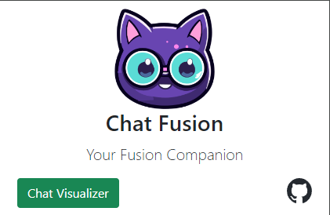

# Changelog

All notable changes to this project will be documented in this file.

## [Unreleased]

### Added
- dev dependencie `cfx` in order to add the `copy-static` script in `package.json`
- a popup file in the chrome extension to permit the user to directly open the react page. Now the link it's hardcoded  

  

  

- add a retry system to connect to the chat in `index.ts` in order to manage anomalies in case the component is loaded faster than the page
- add a `sessionId` generated each time there is a "reload" of the page so the webapp inserts a divider to let the streamer knows where the 
chat session begins
- add `ChatDivider` component to let the user know when the chat has been reloaded
- add a footer on the chat that indicates if the autoreload is `on` or `off`
- add a badge on the extension in order to detect if it is connected to a chat  

  

  

### Changed
- `build` script in order to build the Chrome extension and copy all the relevant files in the ui folder

### Notes
- the ChatDivider and the footer needs a graphical review but they are both working
